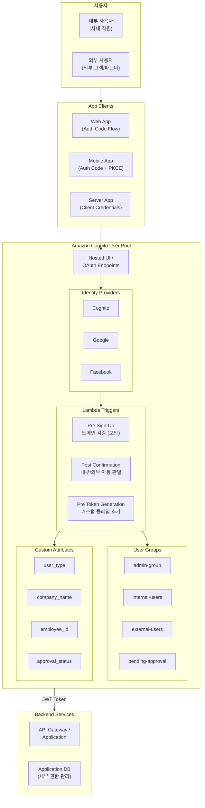
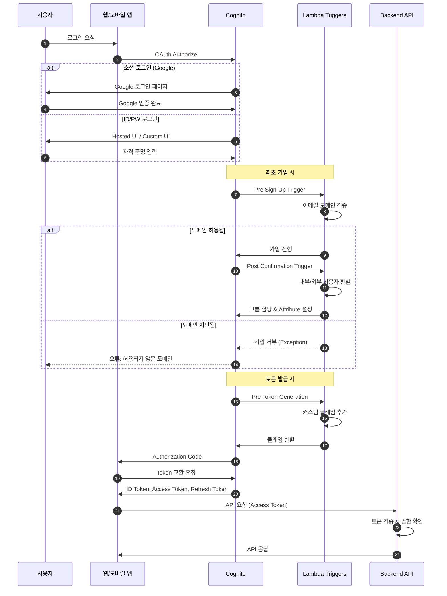
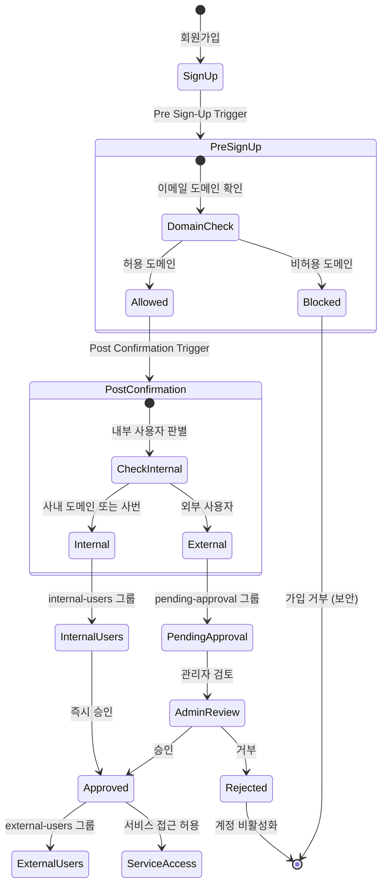
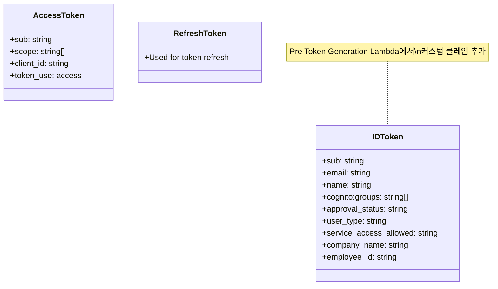
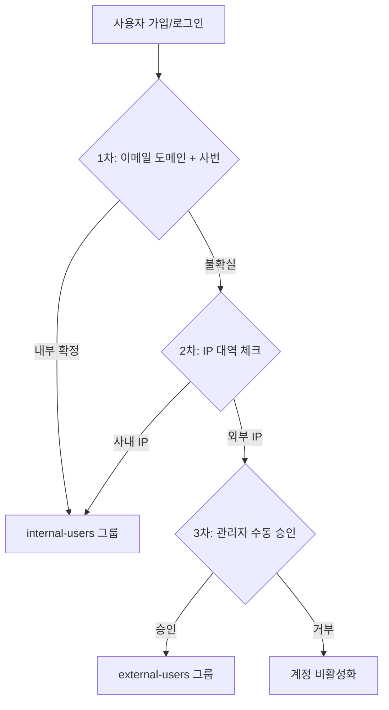
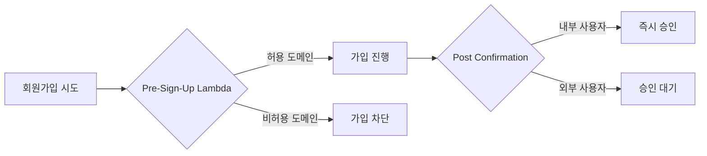
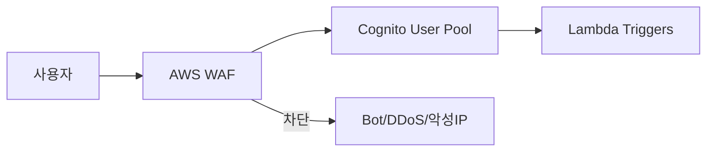

# Amazon Cognito 구현 가이드

> 사용자 인증 시스템 구축을 위한 Amazon Cognito 프로비저닝 가이드

## 목차

- [개요](#개요)
- [아키텍처](#아키텍처)
- [사전 요구사항](#사전-요구사항)
- [Quick Start](#quick-start)
- [단계별 구현 가이드](#단계별-구현-가이드)
- [Q&A 상세 답변](#qa-상세-답변)
- [관리자 운영 가이드](#관리자-운영-가이드)
- [⚠️ 보안 주의사항](#보안-주의사항)
- [리소스 정리](#리소스-정리)
- [참고 문서](#참고-문서)

---

## 개요

이 프로젝트는 Amazon Cognito를 사용하여 다음 기능을 구현합니다:

- **사용자 인증**: OAuth 2.0 / OpenID Connect 기반 인증
- **소셜 로그인**: Google 등 외부 IdP 연동
- **사용자 유형 관리**: 내부/외부 사용자 자동 판별
- **승인 워크플로우**: 외부 사용자 승인 대기 처리
- **멀티 서비스 SSO**: 여러 서비스에서 동일 User Pool 사용
- **역할 기반 접근 제어**: Groups를 활용한 권한 분기

---

## 아키텍처

### 전체 아키텍처



### 인증 플로우



### 사용자 승인 워크플로우



### 토큰 구조



---

## 사전 요구사항

### 필수 도구

```bash
# AWS CLI v2
aws --version  # aws-cli/2.x.x 이상

# jq (JSON 파싱용)
jq --version

# Python 3.9+ (Lambda 개발용)
python3 --version
```

### AWS 권한

프로비저닝을 실행하는 IAM 사용자/역할에 다음 권한이 필요합니다:

- `cognito-idp:*` - Cognito User Pool 관리
- `lambda:*` - Lambda 함수 관리
- `iam:CreateRole`, `iam:PutRolePolicy`, `iam:DeleteRole` - IAM 역할 관리
- `logs:*` - CloudWatch Logs (Lambda 로깅)

---

## Quick Start

```bash
# 1. 설정 파일 생성
cd scripts
cp config.env.example config.env

# 2. config.env 수정 (필수!)
# - AWS_ACCOUNT_ID
# - AWS_REGION
# - USER_POOL_NAME
# - DOMAIN_PREFIX
# - 기타 설정값

# 3. 전체 프로비저닝 실행
./provision-all.sh

# 4. (선택) Google 소셜 로그인 연동
./08-setup-google-idp.sh

# 5. (테스트 후) 리소스 정리
./cleanup.sh
```

---

## 단계별 구현 가이드

### Step 1: User Pool 생성

> **관련 Q&A**: [Q1](#q1-cognito에서-지원하는-인증-프로토콜), [Q3](#q3-사용자-정보-구조)

```bash
./scripts/01-create-user-pool.sh
```

**생성되는 리소스:**
- User Pool
- Custom Attributes 5개

**Custom Attributes:**

| Attribute | 용도 | 예시 값 |
|-----------|------|--------|
| `custom:user_type` | 내부/외부 사용자 구분 | `internal`, `external` |
| `custom:company_name` | 외부 고객/파트너 회사명 | `ABC Company` |
| `custom:employee_id` | 사번 (내부 사용자) | `EMP001` |
| `custom:approval_status` | 승인 상태 | `pending`, `approved` |
| `custom:is_agency` | 파트너사 여부 | `true`, `false` |

**참고 문서:**
- [Creating a user pool](https://docs.aws.amazon.com/cognito/latest/developerguide/cognito-user-pool-as-user-directory.html)
- [Configuring user pool attributes](https://docs.aws.amazon.com/cognito/latest/developerguide/user-pool-settings-attributes.html)

---

### Step 2: Cognito Domain 설정

> **관련 Q&A**: [Q7](#q7-자체-ui로-oidc-연동), [Q8](#q8-hosted-ui-커스터마이징)

```bash
./scripts/02-create-domain.sh
```

**생성되는 엔드포인트:**

| 엔드포인트 | URL |
|-----------|-----|
| Hosted UI | `https://{domain}.auth.{region}.amazoncognito.com/login` |
| Token | `https://{domain}.auth.{region}.amazoncognito.com/oauth2/token` |
| Authorize | `https://{domain}.auth.{region}.amazoncognito.com/oauth2/authorize` |
| Logout | `https://{domain}.auth.{region}.amazoncognito.com/logout` |

**참고 문서:**
- [Adding a domain to a user pool](https://docs.aws.amazon.com/cognito/latest/developerguide/cognito-user-pools-assign-domain.html)

---

### Step 3: App Client 생성

> **관련 Q&A**: [Q2](#q2-인증-플로우별-설정), [Q11](#q11-멀티-서비스-sso)

```bash
./scripts/03-create-app-clients.sh
```

**App Client 유형:**

| Client | OAuth Flow | Secret | 용도 |
|--------|-----------|--------|------|
| Web App | Authorization Code | Yes | 웹 앱 (서버 사이드) |
| Mobile App | Authorization Code + PKCE | No | 모바일/SPA (Public) |

**참고 문서:**
- [Configuring a user pool app client](https://docs.aws.amazon.com/cognito/latest/developerguide/user-pool-settings-client-apps.html)
- [OAuth 2.0 grants](https://docs.aws.amazon.com/cognito/latest/developerguide/federation-endpoints-oauth-grants.html)

---

### Step 4: Resource Server 생성

> **관련 Q&A**: [Q2](#q2-인증-플로우별-설정) (Client Credentials Flow)

```bash
./scripts/04-create-resource-server.sh
```

서버 간 통신(M2M)을 위한 Resource Server와 Server-to-Server App Client를 생성합니다.

**참고 문서:**
- [Defining resource servers](https://docs.aws.amazon.com/cognito/latest/developerguide/cognito-user-pools-define-resource-servers.html)

---

### Step 5: Groups 생성

> **관련 Q&A**: [Q5](#q5-내부-사용자-자동-판별), [Q15](#q15-사용자-역할-구분), [Q17](#q17-승인-대기-관리)

```bash
./scripts/05-create-groups.sh
```

**Groups:**

| Group | Precedence | 용도 |
|-------|------------|------|
| `admin-group` | 1 | 운영 관리자 |
| `internal-users` | 10 | 내부 직원 |
| `external-users` | 20 | 외부 외부 고객/파트너 |
| `pending-approval` | 30 | 승인 대기 |

**참고 문서:**
- [Adding groups to a user pool](https://docs.aws.amazon.com/cognito/latest/developerguide/cognito-user-pools-user-groups.html)

---

### Step 6: Lambda Triggers 설정

> **관련 Q&A**: [Q5](#q5-내부-사용자-자동-판별), [Q6](#q6-lambda-trigger-구현)

```bash
./scripts/06-setup-lambda-triggers.sh
```

**Lambda Functions:**

| Function | Trigger | 기능 |
|----------|---------|------|
| PostConfirmation | Post Confirmation | 내부/외부 사용자 자동 판별, 그룹 할당 |
| PreTokenGeneration | Pre Token Generation | 토큰에 커스텀 클레임 추가 |

**제약사항:**

| 항목 | 제한 |
|-----|-----|
| Lambda 타임아웃 | **5초** |
| 호출 방식 | 동기 (외부 API 타임아웃 주의) |
| 실패 시 | 재시도 없음 (가입 실패) |

**참고 문서:**
- [Customizing user pool workflows with Lambda triggers](https://docs.aws.amazon.com/cognito/latest/developerguide/cognito-user-identity-pools-working-with-aws-lambda-triggers.html)

---

### Step 7: 테스트 사용자 생성

> **관련 Q&A**: [Q4](#q4-추가-회원-정보-저장), [Q14](#q14-관리자-기능)

```bash
./scripts/07-create-test-users.sh
```

**참고 문서:**
- [AdminCreateUser API](https://docs.aws.amazon.com/cognito-user-identity-pools/latest/APIReference/API_AdminCreateUser.html)

---

### Step 8: Google 소셜 로그인 연동

> **관련 Q&A**: [Q9](#q9-소셜-로그인-provider), [Q10](#q10-소셜-로그인-후-추가-정보)

**사전 작업 (Google Cloud Console):**

1. [Google Cloud Console](https://console.cloud.google.com/) 접속
2. **APIs & Services > Credentials > CREATE CREDENTIALS > OAuth client ID**
3. Application type: **Web application**
4. Authorized redirect URIs에 추가:
   ```
   https://{your-domain}.auth.{region}.amazoncognito.com/oauth2/idpresponse
   ```
5. Client ID와 Client Secret을 `config.env`에 설정

```bash
./scripts/08-setup-google-idp.sh
```

**자체 UI에서 Google 로그인 사용:**

```javascript
// identity_provider 파라미터로 특정 IdP 지정
const googleLoginUrl = `https://${COGNITO_DOMAIN}.auth.${REGION}.amazoncognito.com/oauth2/authorize?` +
  `identity_provider=Google&` +
  `client_id=${CLIENT_ID}&` +
  `response_type=code&` +
  `scope=openid+email+profile&` +
  `redirect_uri=${CALLBACK_URL}`;

window.location.href = googleLoginUrl;
```

**참고 문서:**
- [Adding social identity providers](https://docs.aws.amazon.com/cognito/latest/developerguide/cognito-user-pools-social-idp.html)

---

## Q&A 상세 답변

### 인증 프로토콜 & 인증 플로우

#### Q1. Cognito에서 지원하는 인증 프로토콜

| 프로토콜 | 주 사용 목적 | 권장 시나리오 |
|---------|------------|-------------|
| **OAuth 2.0 / OIDC** | 기본 인증 | 모바일/웹 앱, SPA |
| **SAML 2.0** | 외부 IdP 연동 | 기업 IdP(AD FS, Okta) 연동 |

**관련 구현**: [Step 1](#step-1-user-pool-생성)

---

#### Q2. 인증 플로우별 설정

| 플로우 | 지원 | 권장 |
|-------|-----|------|
| Authorization Code (+ PKCE) | ✅ | **권장** |
| Implicit Flow | ✅ | ⚠️ 비권장 |
| Client Credentials | ✅ | 서버 간 통신 |

**관련 구현**: [Step 3](#step-3-app-client-생성), [Step 4](#step-4-resource-server-생성)

---

### 사용자 정보 저장 구조

#### Q3. 사용자 정보 구조

**Custom Attribute 제약사항:**

| 항목 | 제한 |
|-----|-----|
| 최대 개수 | **50개** |
| 최대 길이 | **2048자** |
| 접두사 | `custom:` 필수 |
| 삭제 | **생성 후 삭제 불가** |

**관련 구현**: [Step 1](#step-1-user-pool-생성)

---

#### Q4. 추가 회원 정보 저장

| 주체 | API | 권한 |
|-----|-----|-----|
| 사용자 본인 | `UpdateUserAttributes` | Access Token |
| 관리자/서버 | `AdminUpdateUserAttributes` | IAM 권한 |

**관련 구현**: [Step 7](#step-7-테스트-사용자-생성)

---

### 내부 사용자 자동 판별

#### Q5. 내부 사용자 자동 판별

**Post Confirmation Lambda Trigger**를 사용하여 가입 시 자동 판별

**관련 구현**: [Step 6](#step-6-lambda-triggers-설정)

---

#### Q6. Lambda Trigger 구현

**제약사항:**
- Lambda 타임아웃: **5초**
- 실패 시 재시도 없음

**관련 구현**: [Step 6](#step-6-lambda-triggers-설정)

---

### 로그인 UI

#### Q7. 자체 UI로 OIDC 연동

**가능합니다.** 구현 방식:
1. Cognito User Pool API 직접 호출
2. **AWS Amplify SDK 사용 (권장)**
3. OIDC Authorization Endpoint 리다이렉트

**소셜 로그인도 자체 UI에서 가능:**
```javascript
// identity_provider 파라미터로 특정 IdP 지정
const googleLoginUrl = `https://${COGNITO_DOMAIN}/oauth2/authorize?identity_provider=Google&...`;
```

**관련 구현**: [Step 2](#step-2-cognito-domain-설정)

---

#### Q8. Hosted UI 커스터마이징

| 항목 | 가능 여부 |
|-----|---------|
| 로고/배경색/CSS | ✅ 제한적 |
| App Client 단위 UI 분기 | ❌ **불가** |
| 레이아웃 변경 | ❌ **불가** |

---

### 소셜 로그인

#### Q9. 소셜 로그인 Provider

**기본 지원:** Google, Facebook, Amazon, Apple

**추가 지원:**
- ✅ Custom OIDC Provider
- ✅ SAML 2.0 IdP

**관련 구현**: [Step 8](#step-8-google-소셜-로그인-연동)

---

#### Q10. 소셜 로그인 후 추가 정보

**가능합니다.** 단, IdP Attribute가 매 로그인 시 덮어쓰기될 수 있음에 주의

---

### 멀티 서비스 SSO

#### Q11. 멀티 서비스 SSO

**가능합니다.** 동일 User Pool에 여러 App Client 생성

**관련 구현**: [Step 3](#step-3-app-client-생성)

---

#### Q12. 세션 유지

| 방식 | SSO 세션 유지 |
|-----|-------------|
| Hosted UI 사용 | ✅ 자동 |
| 자체 UI 사용 | 별도 구현 필요 |

---

#### Q13. SSO 로그아웃

`GlobalSignOut` API 사용. 단, 이미 발급된 Access Token은 만료까지 유효

---

### 관리자 기능

#### Q14. 관리자 기능

| 기능 | API | 지원 |
|-----|-----|------|
| 사용자 조회 | `ListUsers`, `AdminGetUser` | ✅ |
| 활성/비활성화 | `AdminEnableUser`, `AdminDisableUser` | ✅ |
| Attribute 수정 | `AdminUpdateUserAttributes` | ✅ |
| 강제 로그아웃 | `AdminUserGlobalSignOut` | ✅ |

---

#### Q15. 사용자 역할 구분

**권장: Cognito Group 사용**

ID Token의 `cognito:groups` 클레임으로 권한 분기

**관련 구현**: [Step 5](#step-5-groups-생성)

---

#### Q16. RBAC 관리

**권장 구조:**
- **Cognito**: 인증 + 기본 역할 구분
- **애플리케이션**: 세부 권한 관리

---

#### Q17. 승인 대기 관리

`pending-approval` 그룹 + `custom:approval_status` Attribute 사용

**관련 구현**: [Step 5](#step-5-groups-생성), [Step 6](#step-6-lambda-triggers-설정)

---

### 감사 로그

#### Q18. 감사 로그

**기본 제공:** AWS CloudTrail로 모든 Cognito API 호출 로깅

**보완:** Lambda Trigger에서 커스텀 로깅

---

### IP 기반 사용자 구분

#### Q19. IP 기반 내부/외부 사용자 구분

**질문**: IP 주소를 기반으로 내부 사용자와 외부 사용자를 구분할 수 있나요?

**답변**: **기술적으로 가능하지만 제약사항이 있습니다.**

##### Lambda Trigger에서 IP 접근

```python
def lambda_handler(event, context):
    source_ip = event.get('callerContext', {}).get('sourceIp', '')
```

##### IP 기반 구분의 한계점

| 상황 | 문제점 |
|------|--------|
| **재택근무자** | 사내 IP가 아닌 가정용 IP 사용 |
| **VPN 사용자** | VPN 서버 IP로 보이거나, 터널링 후 IP가 달라짐 |
| **모바일 사용자** | 이동 중 IP가 계속 변경됨 |
| **NAT/Proxy** | 여러 사용자가 동일 IP로 보임 |
| **CloudFront/ALB 경유** | 실제 IP가 X-Forwarded-For 헤더에 있음 |

##### 권장 접근 방식 (하이브리드)



##### IP 기반 구분 구현 예시

```python
import ipaddress

# config.env에서 INTERNAL_IP_RANGES 환경변수로 설정
INTERNAL_IP_RANGES = os.environ.get('INTERNAL_IP_RANGES', '10.0.0.0/8,172.16.0.0/12,192.168.0.0/16').split(',')

def is_internal_ip(ip_str):
    try:
        ip = ipaddress.ip_address(ip_str)
        for cidr in INTERNAL_IP_RANGES:
            if ip in ipaddress.ip_network(cidr.strip()):
                return True
    except ValueError:
        pass
    return False
```

##### 대안: 접근 제어 레벨에서 IP 체크

| 방식 | 설명 |
|------|------|
| **AWS WAF** | API Gateway/ALB 앞단에서 IP 기반 접근 제어 |
| **VPN 필수화** | 민감 서비스는 VPN 접속 시에만 허용 |
| **Lambda Authorizer** | API 호출 시점에 IP 체크 |

##### 방식별 비교

| 방식 | 장점 | 단점 |
|------|------|------|
| **이메일/사번 기반** (현재) | 안정적, 위치 무관 | 개인 이메일 사용 시 구분 불가 |
| **IP 기반** | 네트워크 레벨 구분 | 재택/VPN/모바일 대응 어려움 |
| **하이브리드** | 다중 검증으로 정확도 향상 | 구현 복잡도 증가 |

**결론**: 사내 네트워크에서만 접속하는 환경이라면 IP 기반이 유효하지만, 재택근무나 모바일 접속이 있다면 **이메일 도메인 + 사번** 방식이 더 안정적입니다.

**참고 문서:**
- [Pre authentication Lambda trigger](https://docs.aws.amazon.com/cognito/latest/developerguide/user-pool-lambda-pre-authentication.html)
- [AWS WAF](https://docs.aws.amazon.com/waf/latest/developerguide/what-is-aws-waf.html)

---

## 관리자 운영 가이드

### 사용자 조회

```bash
# 전체 사용자 목록
aws cognito-idp list-users \
  --user-pool-id $USER_POOL_ID \
  --query 'Users[].{Email:Attributes[?Name==`email`].Value|[0]}' \
  --output table
```

### 사용자 승인 처리

```bash
# Attribute 업데이트
aws cognito-idp admin-update-user-attributes \
  --user-pool-id $USER_POOL_ID \
  --username "user@example.com" \
  --user-attributes Name=custom:approval_status,Value="approved"

# 그룹 변경
aws cognito-idp admin-remove-user-from-group \
  --user-pool-id $USER_POOL_ID \
  --username "user@example.com" \
  --group-name "pending-approval"

aws cognito-idp admin-add-user-to-group \
  --user-pool-id $USER_POOL_ID \
  --username "user@example.com" \
  --group-name "external-users"
```

---

## 보안 주의사항

### ⚠️ 자가등록(Self-Registration) 보안

이 프로젝트는 **자가등록을 허용**하되 **Pre-Sign-Up Lambda로 도메인을 검증**하는 방식을 사용합니다.



### 필수 설정

`config.env`에서 반드시 설정해야 하는 보안 관련 변수:

| 변수명 | 설명 | 예시 |
|--------|------|------|
| `ALLOWED_SIGNUP_DOMAINS` | 회원가입 허용 도메인 목록 | `company.co.kr,partner.com` |
| `INTERNAL_EMAIL_DOMAINS` | 내부 사용자 판별 도메인 | `company.co.kr` |

```bash
# 예시: config.env
ALLOWED_SIGNUP_DOMAINS=your-company.co.kr,partner-agency.com,advertiser.co.kr
INTERNAL_EMAIL_DOMAINS=your-company.co.kr
```

### Lambda Trigger 실행 순서

| 순서 | Trigger | 기능 | 실행 시점 |
|------|---------|------|----------|
| 1 | **Pre Sign-Up** | 이메일 도메인 검증 | 회원가입 시도 시 |
| 2 | **Post Confirmation** | 내부/외부 판별, 그룹 할당 | 이메일 인증 완료 후 |
| 3 | **Pre Token Generation** | 커스텀 클레임 추가 | 토큰 발급 시 (매 로그인) |

### 보안 체크리스트

- [ ] `ALLOWED_SIGNUP_DOMAINS`가 설정되어 있는지 확인
- [ ] Pre-Sign-Up Lambda가 User Pool에 연결되어 있는지 확인
- [ ] 허용 도메인 목록이 비즈니스 요구사항과 일치하는지 확인
- [ ] CloudWatch Logs에서 차단된 가입 시도 모니터링

### 설정하지 않으면 어떻게 되나요?

`ALLOWED_SIGNUP_DOMAINS`를 설정하지 않으면:
- **모든 회원가입이 차단됩니다** (보안 기본값)
- Lambda 로그에 경고 메시지가 기록됩니다
- 관리자가 직접 생성한 계정(AdminCreateUser)은 영향 없음

### AWS WAF 적용 (권장)

외부 사용자 가입을 허용하는 경우, Cognito User Pool에 WAF를 연결하여 추가 보안을 적용할 수 있습니다.



#### WAF 연결 방법

```bash
# Cognito User Pool에 WAF Web ACL 연결
aws wafv2 associate-web-acl \
  --web-acl-arn "arn:aws:wafv2:ap-northeast-2:${AWS_ACCOUNT_ID}:regional/webacl/cognito-protection/xxx" \
  --resource-arn "${USER_POOL_ARN}"
```

#### 권장 WAF 규칙

| 규칙 | 목적 | 설정 예시 |
|------|------|----------|
| Rate Limiting | 무차별 로그인 시도 방지 | IP당 분당 100회 제한 |
| AWS Managed Rules | 일반 웹 공격 방지 | `AWSManagedRulesCommonRuleSet` |
| Bot Control | 자동화된 봇 차단 | `AWSManagedRulesBotControlRuleSet` |
| IP Reputation | 알려진 악성 IP 차단 | `AWSManagedRulesAmazonIpReputationList` |

### Cognito Quota 관리

#### 가상 고객의 케이스 검토

```
예상 규모:
- 내부 직원: ~수백 명
- 외부 사용자: ~수천 명
- 동시 로그인 피크: 업무 시작 시간 (예: 오전 9시)
```

#### 주요 Quota Limits

| 항목 | 기본 한도 | 수천 명 규모 | 증설 필요 |
|------|----------|-------------|----------|
| UserAuthentication (로그인) | 120 RPS | 여유 있음 | 모니터링 후 판단 |
| UserCreation (가입) | 50 RPS | 여유 있음 | 불필요 |
| TokenRefresh (토큰 갱신) | 120 RPS | 여유 있음 | 모니터링 후 판단 |
| Users per Pool | 40,000,000 | 여유 있음 | 불필요 |
| Lambda Trigger Timeout | **5초 (고정)** | - | 변경 불가 |

> **참고**: 수천 명 수준에서는 대부분 기본 한도로 충분합니다. 단, 피크 시간대 모니터링은 필수입니다.

#### CloudWatch 모니터링 설정 (권장)

```bash
# Throttling 발생 시 알람
aws cloudwatch put-metric-alarm \
  --alarm-name "Cognito-Throttling-Alert" \
  --metric-name "ThrottleCount" \
  --namespace "AWS/Cognito" \
  --statistic Sum \
  --period 300 \
  --threshold 10 \
  --comparison-operator GreaterThanThreshold \
  --evaluation-periods 1 \
  --alarm-actions "arn:aws:sns:ap-northeast-2:${AWS_ACCOUNT_ID}:alerts"
```

#### Quota 증설 요청 방법

```bash
# 현재 Quota 확인
aws service-quotas get-service-quota \
  --service-code cognito-idp \
  --quota-code L-XXXXX

# AWS Console > Service Quotas > Amazon Cognito에서 증설 요청
```

### 운영 체크리스트

- [ ] WAF Web ACL이 User Pool에 연결되어 있는지 확인
- [ ] CloudWatch 알람이 설정되어 있는지 확인 (Throttling, 로그인 실패)
- [ ] Lambda Trigger에서 외부 API 호출 없는지 확인 (5초 타임아웃 제한)
- [ ] 피크 시간대 모니터링 대시보드 구성

---

## 리소스 정리

```bash
./scripts/cleanup.sh
```

---

## 참고 문서

| 주제 | URL |
|-----|-----|
| Cognito Developer Guide | https://docs.aws.amazon.com/cognito/latest/developerguide/ |
| OAuth 2.0 Grants | https://docs.aws.amazon.com/cognito/latest/developerguide/federation-endpoints-oauth-grants.html |
| Lambda Triggers | https://docs.aws.amazon.com/cognito/latest/developerguide/cognito-user-identity-pools-working-with-aws-lambda-triggers.html |
| Social IdP 연동 | https://docs.aws.amazon.com/cognito/latest/developerguide/cognito-user-pools-social-idp.html |
| User Groups | https://docs.aws.amazon.com/cognito/latest/developerguide/cognito-user-pools-user-groups.html |
| API Reference | https://docs.aws.amazon.com/cognito-user-identity-pools/latest/APIReference/Welcome.html |

---

## 라이선스

MIT License
